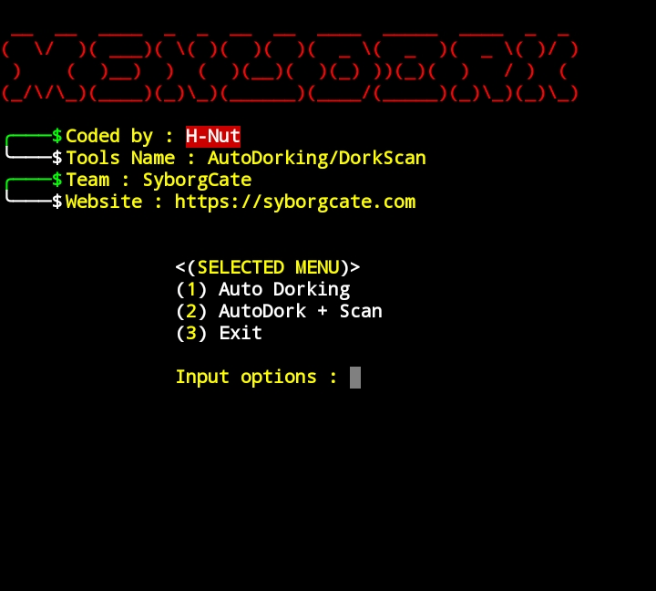
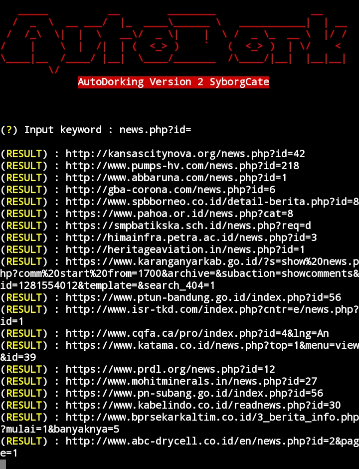
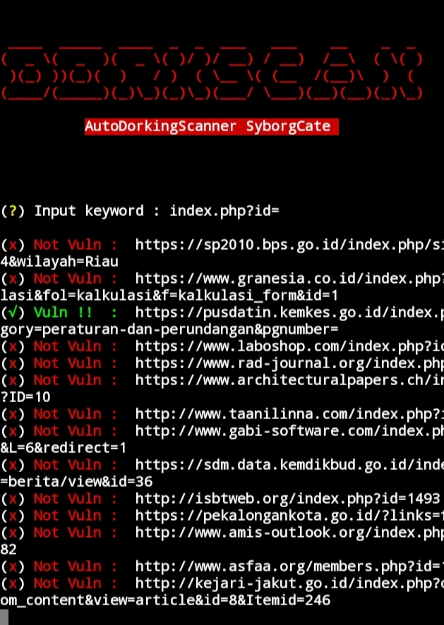

# AutoDorking
Dork is a search string that uses advanced search queries to find information that isn't easily available on a website

### Menu display ✨
<p align="center">
  <a name="top" href="#octocat-hi-there-thanks-for-visiting-">
     
  </a>
</p>

### AutoDork 💥
<p align="center">
  <a name="top" href="#octocat-hi-there-thanks-for-visiting-">
     
  </a>
</p>

### DorkScan 🚀
<p align="center">
  <a name="top" href="#octocat-hi-there-thanks-for-visiting-">
     
  </a>
</p>

# Installation 💢
<details open>
<summary> Android / Linux</summary>

- ```bash
  $ apt update && apt upgrade
  ```

- ```bash
  $ apt install python2 git -y
  ```
- ```bash
  $ apt install pip 
  ```
- ```bash
  $ pip install requests
  ```
- ```bash
  $ pip install urllib3
  ```
- ```bash
  $ pip install google
  ```

- ```bash
  $ git clone https://github.com/SyborgSyndicate/AutoDorking
  ```

- ```bash
  $ cd AutoDorking
  ```

- ```bash
  $ python3 AutoDorking.py
  ```
